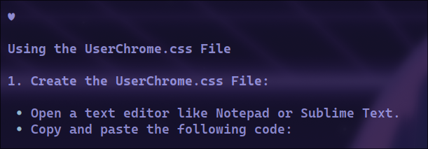

## About
This is a simple Python script that allows you to ask Gemini anything from your Windows command line directly. Sometimes you just need to know a command or anything else, and it's useful to have it readily available.

## Installation
Create a folder for this project, open the command line, and type:
```
git clone https://github.com/cebem1nt/ask-ai.git
```
For this project you need python installed. and **Google AI api key**. 

### Windows
```
cd ask-ai/windows
setup.bat
```
### Linux 
```
cd ask-ai/linux
sudo chmod +x setup.sh
./setup.sh
```

## **These notes might help you!**
***The project depends on the path where you've downloaded this repository.*** If you move it to another directory,
run the installation again to make it work properly.
### Linux 
- The config is located in ``.config/askai/key.ini``
- For using system-widely, ``setup.sh`` creates a script and adds it to ``/usr/bin``

### Windows 
- The key config is just a python file at the same directory
- The ``setup.bat`` file adds the dirrectory to the ``PATH`` variable

## Usage
Simply type ``askai`` followed by your query in your terminal.
```
askai 'how to customize firefox with css?'
```
